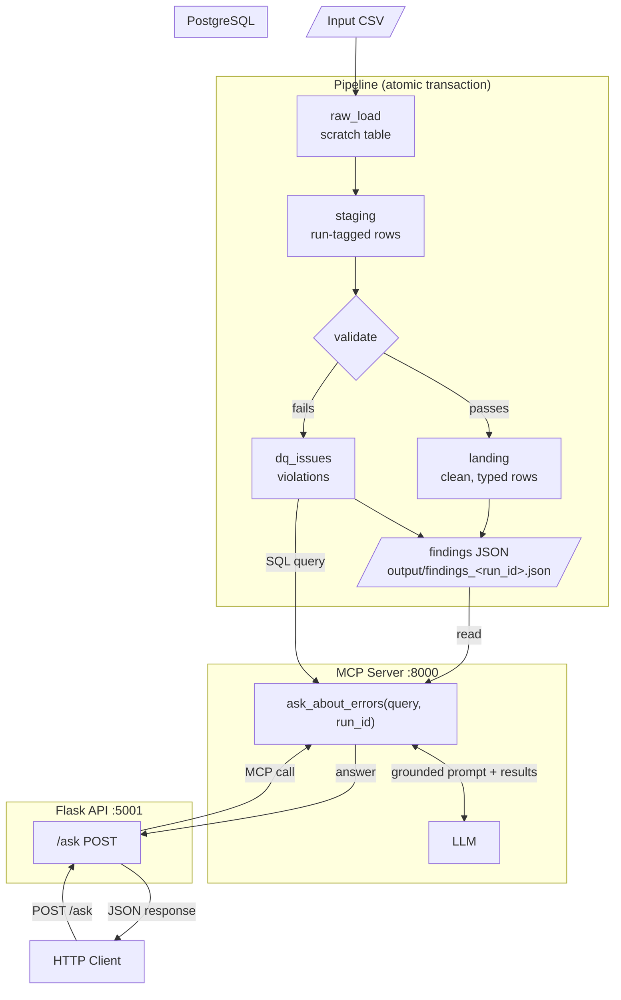

# Architecture Diagram

```mermaid
flowchart TD
    CSV[/"Input CSV"/]

    subgraph pipeline["Pipeline  (atomic transaction)"]
        direction TB
        RAW["raw_load\nscratch table"]
        STAGING["staging\nrun-tagged rows"]
        VALIDATE{"validate"}
        LANDING["landing\nclean, typed rows"]
        DQISSUES["dq_issues\nviolations"]
        FINDINGS[/"findings JSON\noutput/findings_&lt;run_id&gt;.json"/]

        RAW --> STAGING --> VALIDATE
        VALIDATE -->|"passes"| LANDING
        VALIDATE -->|"fails"| DQISSUES
        LANDING & DQISSUES --> FINDINGS
    end

    subgraph postgres["PostgreSQL"]
        LANDING
        DQISSUES
    end

    subgraph mcp["MCP Server  :8000"]
        TOOL["ask_about_errors(query, run_id)"]
        LLM["LLM"]
        TOOL <-->|"grounded prompt + results"| LLM
    end

    subgraph api["Flask API  :5001"]
        ENDPOINT["/ask  POST"]
    end

    CSV --> RAW
    DQISSUES -->|"SQL query"| TOOL
    FINDINGS -->|"read"| TOOL
    CLIENT["HTTP Client"] -->|"POST /ask"| ENDPOINT
    ENDPOINT -->|"MCP call"| TOOL
    TOOL -->|"answer"| ENDPOINT
    ENDPOINT -->|"JSON response"| CLIENT
```
